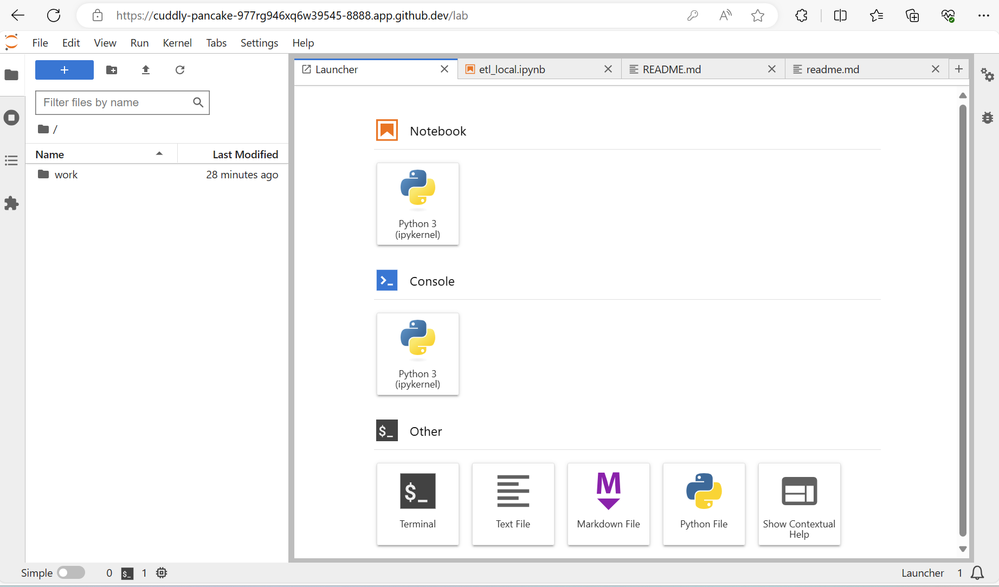
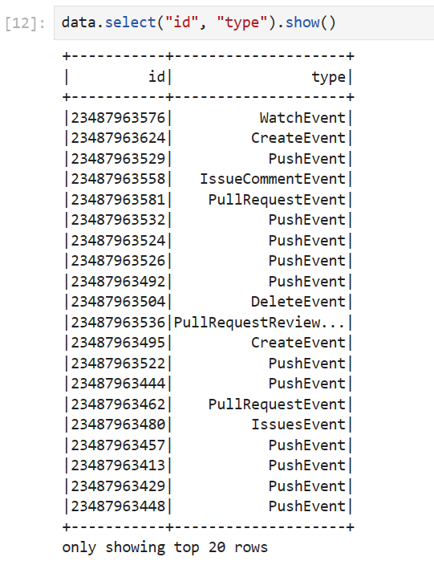
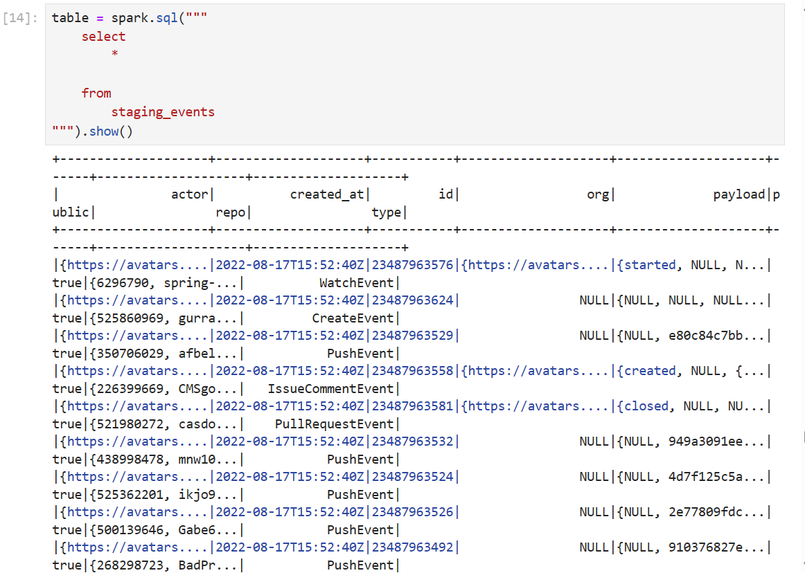
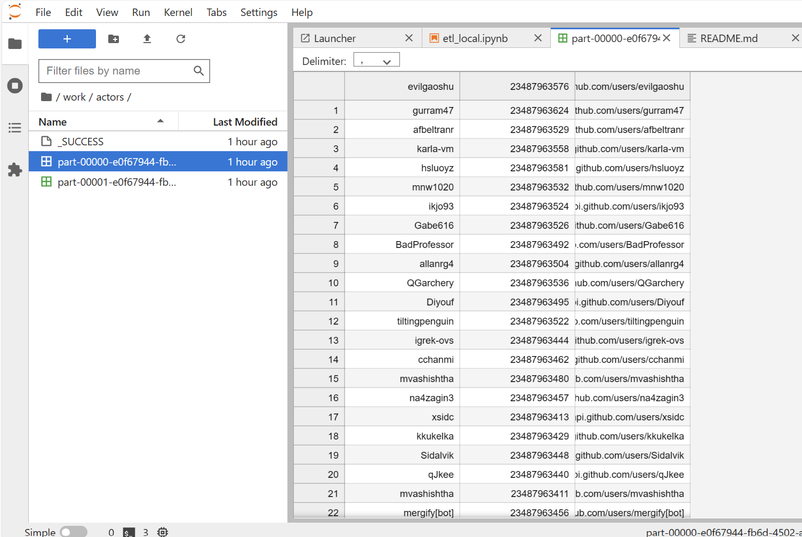

## Instruction Building a data lake ##

1. เปิด file 04-building-a-data-lake โดยใช้คำสั่ง
```sh
$ cd 04-building-a-data-lake/
```
2. ทำการเชื่อมต่อ file docker-compose.yml โดยใช้คำสั่ง
```sh
$ docker compose up
```

3. จาก file docker-compose.yml ได้กำหนด ports ไว้เมื่อทำการรันคำสั่ง docker compose up จะได้รับเลข token และเพิ่ม ports
กด ports 8888 ตรง browser จะเชื่อมต่อไปยัง Jupyter Lab ให้นำเลข token จาก terminal มาใส่ เพื่อ log in เข้าระบบ

4. ตัวอย่างหน้าที่เชื่อมต่อกับ Jupyter Lab แล้ว


# Documentaion Building a Data Lake
เมื่อทำการเชื่อมต่อการใช้ data lake บน Jupyter Lab

## etl_local.py script
import spark เข้ามาใช้ใน python
```sh
from pyspark.sql import SparkSession
```

## ใช้ glob ช่วยในการอ่าน ข้อมูลที่เป็น file .json
```sh
p = glob.glob("data/*.json")
```
## ทำการเชื่อมต่อ spark ด้วยคำสั่ง
```sh
spark = SparkSession.builder \
    .appName("ETL") \
    .getOrCreate()
```
เรียกดูข้อมูลจาก file data โดยใช้คำสั่ง
```sh
data.select("id", "type").show()
```


หรือใช้คำสั่ง spark.sql เพื่อใช้ sql เพื่อเรียกดูข้อมูลใน table ได้
```sh
data.createOrReplaceTempView("staging_events")
table = spark.sql("""
    select
        *
    from
        staging_events
""").show()
```


สามารถสร้าง events เพื่อเก็บข้อมูลแยกตามที่ต้องการ เช่น การสร้าง folder actors , repos เก็บข้อมูลเป็น file .csv ไว้
```sh
output_csv = "output_csv"
output_parquet = "output_parquet"
```
```sh
table.write.partitionBy("year").mode("overwrite").csv(output_csv)
```
```sh
table.write.partitionBy("date").mode("overwrite").csv(destination)
```
```sh
destination = "events"
```
```sh
table.write.partitionBy("year", "month", "day").mode("overwrite").csv(destination)
```
```sh
table.write.partitionBy("date").mode("overwrite").csv(destination)
```
เช่น folder actors ต้องการเก็บข้อมูล column  actor login , id , actor url เป็นต้น
```sh
table = spark.sql("""
    select
        actor.login
        , id as event_id
        , actor.url as actor_url
    from
        staging_events
""")
destination = "actors"
table.write.mode("overwrite").csv(destination)
```



# Building a Data Lake

เพื่อให้เราสามารถสร้างไฟล์ได้จาก Jupyter Lab ให้รันคำสั่งด้านล่างนี้

```sh
sudo chmod 777 .
```

แล้วค่อยรัน

```sh
docker-compose up
```

