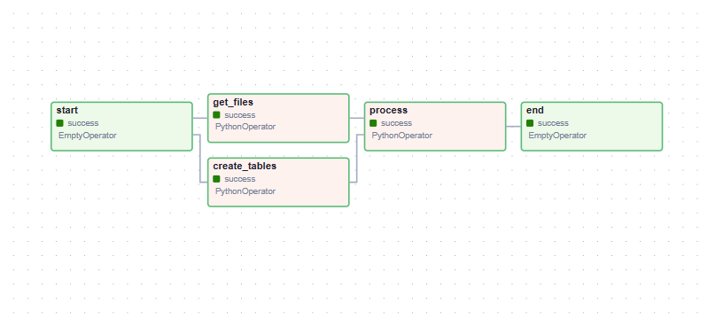

  ## Instruction Building a data pipelines

 หลังจากทำการเชื่อมต่อเข้า file  05-data-pipelines โดยใช้คำสั่ง
```sh
  cd 05-data-pipelines/
```
  1. ทำการสร้าง file etl.py ใน folder dags 

  และสั่งรัน 
```sh
  docker compose up
```
  เพื่อเปิดใช้งาน airflow โดย เราจะสามารถเข้าไปที่หน้า Airflow UI ได้ที่ port 8080

  ## Documentaion Building a Data pipelines
  1. ทำการกำหนดแผนภาพการทำงาน (DAG) ใน Apache Airflow โดยใช้ PythonOperator, EmptyOperator, และ _get_files, _create_tables, _process เป็นฟังก์ชันที่ใช้ในการดำเนินการของแต่ละงานที่ถูกกำหนดไว้ในแผนภาพ ดังนี้

```sh
with DAG(
    "etl",
    start_date=timezone.datetime(2024, 4, 8),
    schedule="@daily",
    tags=["workshop"],
    catchup=False,
) as dag:

    start = EmptyOperator(task_id="start")

    get_files = PythonOperator(
        task_id="get_files",
        python_callable=_get_files,
        op_kwargs={
            "filepath": "/opt/airflow/dags/data",
        }
    )

    create_tables = PythonOperator(
        task_id="create_tables",
        python_callable=_create_tables,
    )
    
    process = PythonOperator(
        task_id="process",
        python_callable=_process,
    )

    end = EmptyOperator(task_id="end")

    #เป็นการกำหนดลำดับการทำงานของแต่ละ task

    start >> [get_files,create_tables] >> process >> end    
```

  จากโค้ดที่แสดงจะเป็นการกำหนดชื่อของ DAG ชื่อว่า "etl" 
  กำหนด start_date เป็น 2024-04-08 เพื่อระบุวันแรกที่ DAG เริ่มทำงาน 
  กำหนดรูปแบบ schedule="@daily" ซึ่งระบุว่า DAG นี้จะรันทุกวัน
  และกำหนด Operators ที่ต้องการ 

  2. ทำการสร้าง task ส่วนของ _get_files, _create_tables, _process

  ```sh
  def _get_files(filepath):
    """
    Description: This function is responsible for listing the files in a directory
    """

    all_files = []
    for root, dirs, files in os.walk(filepath):
        files = glob.glob(os.path.join(root, "*.json"))
        for f in files:
            all_files.append(os.path.abspath(f))

    num_files = len(all_files)
    print(f"{num_files} files found in {filepath}")

    return all_files

def _create_tables():
    table_create_actors = """
        CREATE TABLE IF NOT EXISTS actors (
            id int,
            login text,
            PRIMARY KEY(id)
        )
    """

    table_create_repo = """
        CREATE TABLE IF NOT EXISTS repo (
            id int,
            name text,
            PRIMARY KEY(id)
        )
    """

    table_create_events = """
        CREATE TABLE IF NOT EXISTS events (
            id text,
            type text,
            actor_id int,
            repo_id int,
            PRIMARY KEY(id),
            CONSTRAINT fk_actor FOREIGN KEY(actor_id) REFERENCES actors(id),
            CONSTRAINT fk_repo FOREIGN KEY(repo_id) REFERENCES repo(id)
        )
    """

    create_table_queries = [
        table_create_actors,
	    table_create_repo,
        table_create_events,
    ]
    
    hook = PostgresHook(postgres_conn_id="my_postgres_conn")
    conn = hook.get_conn()
    cur = hook.conn.cursor() 
    for query in create_table_queries:
        cur.execute(query)
        conn.commit()
    

def _process(**context):
    hook = PostgresHook(postgres_conn_id="my_postgres_conn")
    conn = hook.get_conn()
    cur = conn.cursor()

    ti = context["ti"]

    # Get list of files from filepath
    all_files = ti.xcom_pull(task_ids="get_files", key="return_value")
    # all_files = get_files(filepath)

    for datafile in all_files:
        with open(datafile, "r") as f:
            data = json.loads(f.read())
            for each in data:
                # Print some sample data
                
                if each["type"] == "IssueCommentEvent":
                    print(
                        each["id"], 
                        each["type"],
                        each["actor"]["id"],
                        each["actor"]["login"],
                        each["repo"]["id"],
                        each["repo"]["name"],
                        each["created_at"],
                        each["payload"]["issue"]["url"],
                    )
                else:
                    print(
                        each["id"], 
                        each["type"],
                        each["actor"]["id"],
                        each["actor"]["login"],
                        each["repo"]["id"],
                        each["repo"]["name"],
                        each["created_at"],
                    )

                # Insert data into tables here
                insert_statement = f"""
                    INSERT INTO actors (
                        id,
                        login
                    ) VALUES ({each["actor"]["id"]}, '{each["actor"]["login"]}')
                    ON CONFLICT (id) DO NOTHING
                """
                # print(insert_statement)
                cur.execute(insert_statement)

                # Insert data into tables here
                insert_statement = f"""
                    INSERT INTO repo (
                        id,
                        name
                    ) VALUES ({each["repo"]["id"]}, '{each["repo"]["name"]}')
                    ON CONFLICT (id) DO NOTHING
                """
                # print(insert_statement)
                cur.execute(insert_statement)

                # Insert data into tables here
                insert_statement = f"""
                    INSERT INTO events (
                        id,
                        type,
                        actor_id
                    ) VALUES ('{each["id"]}', '{each["type"]}', '{each["actor"]["id"]}')
                    ON CONFLICT (id) DO NOTHING
                """
                # print(insert_statement)
                cur.execute(insert_statement)

                conn.commit()
  ```
จากขั้นตอนที่กล่าวมานี้จะได้แผนภาพดังนี้



